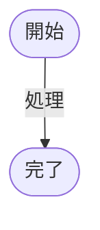

# Stickyleaf

マークダウンと複数タブに対応した半常駐用メモアプリ。
MacOS 標準の Stickies のように画面上にメモを貼っておきたいが、書式がコピーされたり、クオート等が自動的に変換されてしまうのを防ぎたいというのが開発の発端です。

コンセプトは3項目。
- 立ち上げたままでも作業に支障がなく、一時的に文章を置いておく作業台のように使える。
- プレーンな書き味を重視し、エディタ部への入力補助は行わない。
- 文章そのものに書式を持たせず、スタイリングはプレビュー機能に委任する。

## :evergreen_tree: Overview
### マークダウン記法による覚書
基本的なマークダウン記法に対応しています

````md
# 見出しレベル1
## 見出しレベル2

- リスト項目1
- リスト項目2

> 引用


`code`

```js
const text = 'example';
console.log(text);
```

|no|name|
|:--:|:--:|
|1|one|
|2|two|
````

### Mermaid 記法への対応
コードブロックに Mermaid 記法で記述するとフローチャートやシーケンス図として表示されます。
````md

````

### Backlog 記法への変換
メニューから`Backlog記法でコピー`を選択すると、マークダウンからBacklog記法に変換してクリップボードにコピーします。

### Mustache 記法による動的変換
プレースホルダー・条件分岐・繰り返しを使ったシンプルな動的文章を作成可能です。
`MENU`から`テンプレート構文を使用する`を選択すると有効になり、文中にプレースホルダーが入力されると変数値の入力欄を表示します。

テキスト整形のルール (Backlog記法) https://support-ja.backlog.com/hc/ja/articles/360035641594
(現在は、順次マークダウンに移行しているようです。)

#### プレースホルダ `{{ example }}`
変数名を囲うとプレースホルダとなり、定義した値が文章中に展開されます。
```
{{ hour }}時{{ minute }}分
```
#### 条件分岐 `@if (example)` `@endif`
文字列が空でない場合のみ、中に囲われた文章が表示されます。
```
@if (is_shown)
表示
@endif
```
#### 繰り返し `@for (example)` `@endfor`
コンマ区切りで文字列を分割し、分割された数だけ繰り返します。 (構文の内部でプレースホルダを使う)
```
@for (name)
- {{ name }}
@endif
```

## :green_book: Usage

アプリケーションにパッケージ化

```sh
yarn build
```

開発モード

```sh
yarn dev
```
